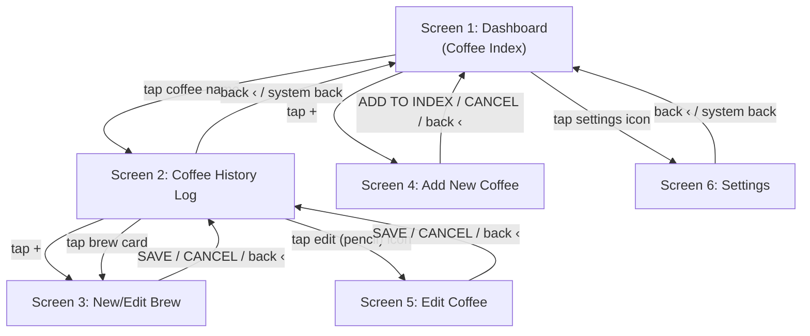

# Coffee Log — Navigation

Screen flow as implemented in `CoffeeLogNavGraph.kt`.

Notes:
- All non-dashboard screens pop back to their caller rather than navigating forward, so the diagram's return edges are back-stack pops, not new destinations.
- `BrewEdit` is reused for both "New Brew" (no `brewId`) and "Edit Brew" (existing `brewId`); see PRD.md Screen 3.
- Long-press on a Dashboard row or History brew card opens a delete confirmation dialog in place — no navigation.
